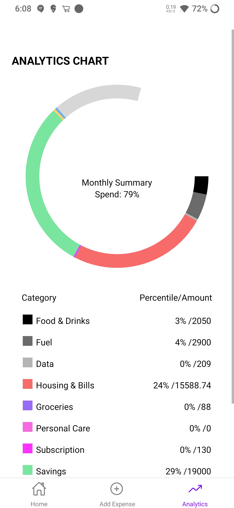

# React Native Expense Tracker App

## Introduction
This is a simple React Native application designed for managing expenses. The app includes features such as user authentication, expense tracking, adding income and savings, and analytics with a pie chart. The backend is powered by Firebase.

## Prerequisites
- Node.js and npm installed
- Expo CLI installed (`npm install -g expo-cli`)

## Getting Started
1. Clone the repository: `git clone https://github.com/yourusername/expense-tracker-react-native.git`
2. Navigate to the project directory: `cd expense-tracker-react-native`
3. Install dependencies: `npm install`
4. Run the app: `expo start`

## Firebase Configuration
1. Create a Firebase project at [Firebase Console](https://console.firebase.google.com/).
2. Add a new web app to your Firebase project and copy the configuration.
3. Add your firebase configuration to firebase.js file:
   ```env
   FIREBASE_API_KEY=your_api_key
   FIREBASE_AUTH_DOMAIN=your_auth_domain
   FIREBASE_PROJECT_ID=your_project_id
   FIREBASE_STORAGE_BUCKET=your_storage_bucket
   FIREBASE_MESSAGING_SENDER_ID=your_messaging_sender_id
   FIREBASE_APP_ID=your_app_id

## Screenshots

### Sign In Screen


### All Expenses Screen


### Add Expense, Savings, and Income Screen
)

### Analytics Screen
)
